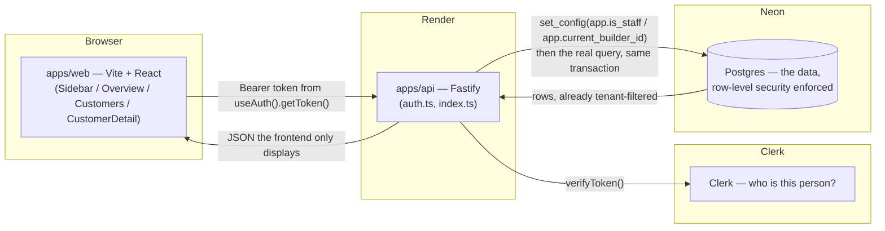
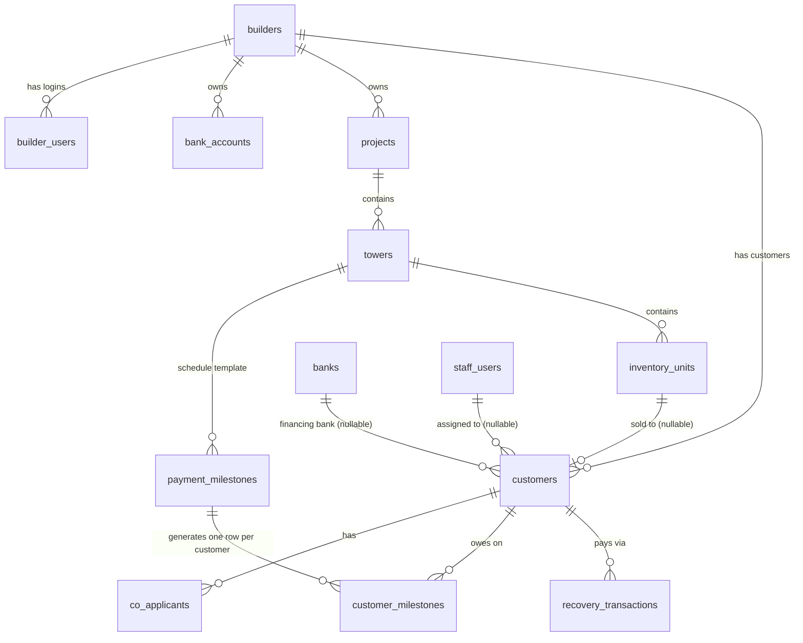
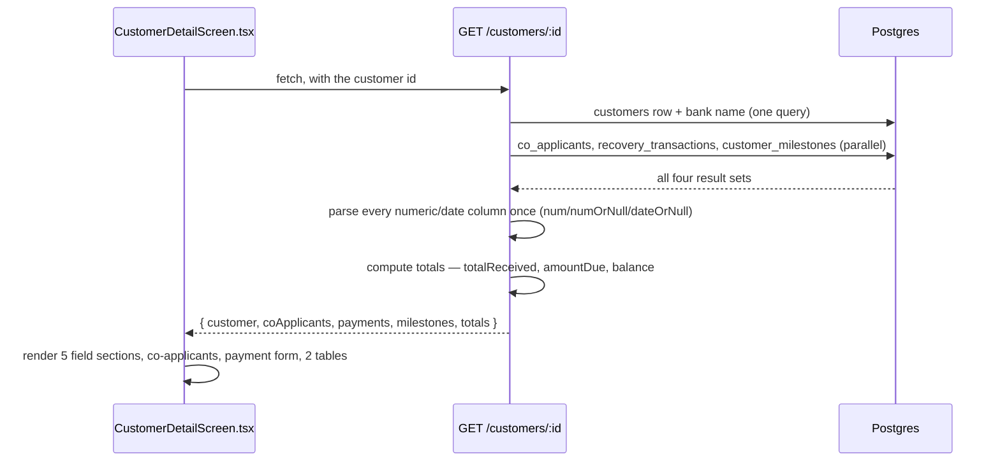
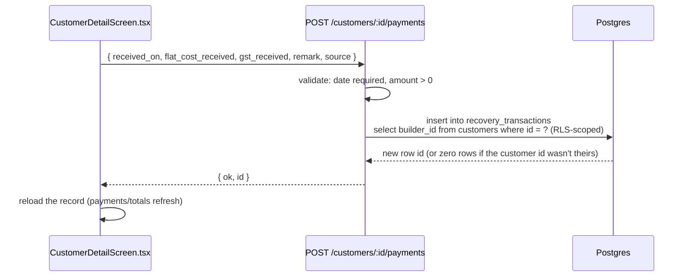

# Technical Documentation

## Change-control rule

Implementation follows the user's exact command and stated scope. Engineers
must not guess, add, simplify, or improve behavior beyond that request. Any
reasonable interpretation or proposed enhancement requires user permission
before code changes are made.

The approved Collections implementation and future-proofing checklist is in
[`docs/COLLECTIONS_FUTURE_PROOFING_PLAN.md`](./COLLECTIONS_FUTURE_PROOFING_PLAN.md).
Read it before adding roles, tenant context, audit, payment corrections,
exports, or new application boundaries. It separates work required now from
future platform capabilities that are deliberately deferred.

**Audience:** whoever is fixing a bug or building the next feature — Azhar,
a future developer, or a future Claude Code session with no memory of how
this was built. `CLAUDE.md` at the repo root tells the *story* (how we got
here, what was decided and why); this file is the *reference* — schema,
data flow, and a file-by-file index so a broken thing can be found fast.

**Keep this updated.** Every commit that adds a table, a route, or a
screen should touch this file in the same commit — a new row in the
tables below, a new flow diagram if the change introduces one, one line
in the file-by-file index. A documentation update that lags the code it
describes is worse than no documentation, because it actively misleads
whoever reads it next. See `docs/FUNCTIONAL_GUIDE.md` for the same rule
applied to the user-facing/business doc.

---

## 0. Approved Collections delivery strategy

Collections is the only application being built now. The reusable foundation
is intentionally small: tenant-aware request context, capability-based
authorization, audit events, settings scope, export contracts, repository
boundaries, and a future-compatible event seam. Future applications must not
require a rewrite of those foundations, but Collections business behavior
must remain unchanged while they are introduced.

The implementation checklist, role definitions, phase gates, deferred work,
and completion criteria live in
[`COLLECTIONS_FUTURE_PROOFING_PLAN.md`](./COLLECTIONS_FUTURE_PROOFING_PLAN.md).

The current database continues to use `builder_id`; new platform-level code
must not assume that a builder is the only possible tenant. A gradual
compatibility migration is required before any universal `tenant_id` change.

### 0.1 Strategic scalability objective

Collections is the first bounded application in the platform architecture
described by the handbook. A future shared product experience may contain
multiple applications, but this does not justify a giant schema or unrestricted
cross-application access. The foundation must address data, user, application,
and operational scale while keeping the current Collections experience stable.

Required properties are:

- reusable platform services with application-owned business rules and data;
- tenant scope in requests, authorization, RLS, jobs, exports, files, search,
  and telemetry;
- contracts before separate deployables;
- independent scaling only for measured bottlenecks;
- provider adapters and canonical exports for portability;
- financial correctness under retries, concurrency, and asynchronous work;
- generic abstractions only for real shared use cases.

The approved maturity path is modular monolith, platform kernel,
multi-application monolith, selective extraction, then regional/provider
scale. The complete guardrails and second-application readiness test are in
[`COLLECTIONS_FUTURE_PROOFING_PLAN.md`](./COLLECTIONS_FUTURE_PROOFING_PLAN.md).

Future-proofing changes require a concrete current requirement, a handbook
requirement, a second-application/provider requirement, or evidence from a
production safety, isolation, financial, portability, or operational issue.
Speculative abstractions are deferred.

### 0.2 Collections baseline inventory

This is the protected baseline for the first implementation phase. Changes
must preserve these routes, migrations, identity classes, and current
Customers behavior unless a separate request explicitly changes them.

#### API routes currently present

| Route | Current purpose |
|---|---|
| `GET /health` | Public API liveness |
| `GET /db-check` | Public database connectivity check |
| `GET /me` | Resolve verified Clerk identity to local staff or builder identity |
| `GET /customers` | Tenant-scoped customer list; currently capped at 1,000 |
| `POST /customers` | Create a customer; staff selects a builder, builder users use their own builder |
| `GET /customers/:id` | Tenant-scoped customer detail, co-applicants, payments, milestones, and totals |
| `PATCH /customers/:id` | Update the allowlisted customer fields |
| `POST /customers/:id/payments` | Insert one payment into `recovery_transactions` |
| `GET /banks` | Authenticated shared bank reference data |
| `GET /builders` | Staff-only builder picker |
| `GET /dashboard/overview` | Tenant-scoped KPI and chart data |
| `GET /dashboard/daily-collection?weeks=N` | Tenant-scoped daily collection chart data |

#### Current identity and access baseline

- Clerk verifies the session token.
- `staff_users` identifies Perfect Solutions staff.
- `builder_users` identifies a builder user and its `builder_id`.
- The current local role is a text value on the staff/builder user row.
- Tenant-scoped queries run through `withTenantClient`.
- RLS uses `app.is_staff` or `app.current_builder_id` inside the same
  transaction as the business query.
- The client never supplies the authority for staff status or builder scope.
- A resolved `staff_users` identity receives the platform-staff capability
  bundle, preserving the pre-capability staff access model. Builder-user role
  values are mapped explicitly, with unknown values denied.
- Protected requests also receive a `RequestContext` with `applicationId`,
  verified `userId`, tenant ID (`null` for staff), correlation ID, identity,
  and capabilities. Tenant-scoped routes pass this context into
  `withTenantClient`; the existing `builder_id` RLS compatibility remains.

The capability model, audit events, and tenant-neutral platform types are
future implementation work; they must be introduced without weakening this
baseline.

#### Current migration baseline

Migrations currently present and applied in numeric order by CI:

1. `0001_init.sql` — core Collections schema and initial RLS.
2. `0002_clerk_auth.sql` — Clerk identity links; removes password hashes.
3. `0003_force_rls.sql` — forced RLS, safe policy comparison, and the
   intentional `builder_users` RLS exemption needed for identity lookup.
4. `0004_settings_and_soft_delete.sql` — customer soft-delete field and
   current application settings table.

#### Customers regression baseline

The current experience that must remain unchanged during foundation work:

- Customers opens from the sidebar.
- Header shows `Customer - All`, count, relative last-refresh age, and refresh.
- Search is a compact expandable magnifier.
- The gear controls visible columns.
- The filter control opens the advanced filter builder.
- Table rows update the URL to `/customers/{id}`.
- Customer detail values load when the record opens, not during initial list
  bootstrap.
- New customer uses the exact `New` label.
- Customer detail retains Overview, Details, and Related records tabs.
- Payment entry adds a ledger row; current correction/reversal flow is not yet
  implemented.
- React Aria controls and the current branded visual system remain in use.

---

## 1. Architecture at a glance



The one rule everything else follows: **the API decides, the frontend
displays.** No business number is computed in `apps/web`, and no access
decision is made there either — every route re-derives who's asking from
the verified Clerk token, never from anything the client claims. Full
reasoning and history: `CLAUDE.md`.

---

## 1.1 Branding and visual tokens

The shared frontend palette is defined in `apps/web/src/theme.ts` and mirrored
as CSS custom properties in `apps/web/src/index.css`. Use these tokens for new
components instead of introducing one-off brand colours:

| Role | Hex | Intended use |
|---|---|---|
| Primary blue | `#1F5FBF` | Section titles, key lines, block fills, stat figures |
| Near-black navy | `#1B2B4B` | Body copy and cover bands |
| Pale blue | `#EEF3FA` | Box fills |
| Off-white | `#F7F9FC` | Image placeholders and light surfaces |
| Hairline tint | `#DCE6F4` | Fact-table rules |
| Rule / border | `#C7D3E4` | Section underlines and box outlines |
| Grey | `#8A8A8A` | Captions and secondary text |
| Reversed text | `#E6EDF7` | Type on blue blocks |

Chart series may retain additional contrast colours where multiple data
categories must remain distinguishable; those are data-visualisation colours,
not application chrome.

---

## 2. Database schema map

13 tables, `db/migrations/0001_init.sql` (`0002`/`0003` alter auth columns
and RLS — see §2.3). Every tenant-scoped table carries `builder_id`
directly, even where it could be derived through a join, so the same
row-level-security rule applies everywhere without tracing through
multiple tables.

### 2.1 Entity-relationship map



### 2.2 Table-by-table

| Table | What it holds (business terms) | RLS? |
|---|---|---|
| `banks` | The list of financing banks a customer's loan can be against. Shared across every builder. | No — shared reference data |
| `staff_users` | Perfect Solutions' own employees. See every builder's data. | No — only reached by staff-gated code paths |
| `builders` | A builder company we work with (e.g. Shilpkaar). | No — the tenant root itself |
| `builder_users` | A builder's own admin/CRM logins. Scoped to their one builder. | **No, deliberately** — see §2.3, bug 3 |
| `bank_accounts` | A builder's own bank accounts (where their collections land). | Yes |
| `projects` | A builder's real-estate project (e.g. "Aarambh"). | Yes |
| `towers` | One tower/building within a project (e.g. "E3"). | Yes |
| `payment_milestones` | The payment-schedule *template* for a tower — e.g. "Plinth, 15%, due on X". Not per-customer yet. | Yes |
| `inventory_units` | One flat/unit in a tower (3 BHK, floor, flat no., rate). | Yes |
| `customers` | The actual buyer — booking/agreement/loan/GST/stamp-duty facts. ~35 columns. See §2.4 for what's deliberately *not* here. | Yes |
| `co_applicants` | A customer's co-applicant(s) on the loan/agreement. | Yes |
| `customer_milestones` | One row per customer per milestone — generated from `payment_milestones`, tracks `amount_due` / `due_date` / `status`. | Yes |
| `recovery_transactions` | The actual payment ledger — every rupee received, one row per payment. Source of truth for "amount received." Insert-only (§4, `POST /customers/:id/payments`). | Yes |
| `app_settings` | *(`0004_settings_and_soft_delete.sql`)* Generic key/value platform config — starting with `customer_highlight_fields`, which fields show at the top of a customer record. | No — app-wide UI config, not tenant data |

### 2.2.1 Schema rationale and future direction

The current tables are deliberately Collections-owned and close to the
imported MIS workbook so the present application remains understandable and
safe. They are not presented as the final schema for every future application.
The rationale, ownership boundary, and planned evolution of every table are
recorded in
[`COLLECTIONS_FUTURE_PROOFING_PLAN.md`](./COLLECTIONS_FUTURE_PROOFING_PLAN.md).

The important rules are:

- tenant ownership is direct on tenant-scoped rows where reliable RLS needs
  it;
- raw facts are stored instead of duplicated spreadsheet-derived values;
- `customer_milestones` represents what is owed, while
  `recovery_transactions` represents what was received;
- posted financial history is preserved rather than overwritten;
- shared reference data is separate from tenant-owned operational data;
- existing `builder_id` columns remain during a tested compatibility migration
  toward a future tenant-neutral platform model;
- future applications must not directly join to or mutate Collections-private
  tables without an explicit contract.

The future platform model may later separate party, customer account, booking,
agreement, unit, obligation, receipt, allocation, adjustment, and loan-case
concepts. That decomposition is intentionally deferred until expand-contract
migrations, reconciliation, and access tests can protect the live Collections
experience.

### 2.2.2 Provider and multi-application boundaries

Clerk, Neon/PostgreSQL, and Render are the current providers, not business
domain contracts. They remain in place now because they are working production
choices. The replaceability boundary is currently partial: `auth.ts` and the
frontend still import Clerk directly, `db.ts` and route code still use the
PostgreSQL/`pg` adapter directly, and Render is represented by deployment
configuration rather than an application runtime adapter. New application
services must use internal identity, tenant context, repository, unit-of-work,
storage, event, and telemetry interfaces rather than adding more provider SDK
coupling.

The current foundations make future replacement narrower than a business-logic
rewrite, but they do not claim that replacement is complete or migration-free.
A future Clerk, PostgreSQL hosting provider, or deployment platform still
requires completing the relevant adapter boundary, configuration migration,
data/schema migration where applicable, and conformance tests. No second
provider is needed today.

Collections is the first bounded application. The reusable platform layer
should own identity links, tenant memberships, capabilities, audit, settings,
exports, file metadata, workflow contracts, event envelopes, correlation, and
telemetry. Collections owns customers, projects, units, milestones, payments,
loans, and its reports. A future application gets its own manifest, tenant
installation rules, schema namespace, migrations, routes, services, and
repositories. It must not directly mutate Collections-private tables.

The recommended scaling path is a modular monolith first. Logical boundaries
are established before separate deployables, services, or regional cells are
introduced. This keeps current delivery simple while allowing future apps or
high-load workers to scale independently when measurements justify it.

`customers` also gained `is_active boolean not null default true` in the
same migration — the soft-delete field: Delete never removes a row, it
sets this false. `GET /customers` filters to `is_active = true`;
`GET /customers/:id` does not (an id you already have still resolves) —
there's no "view archived / restore" screen yet, a disclosed gap.

**`0004` is a manual step, same as `0001`-`0003`** — written and committed
here, but only takes effect once it's actually run against Neon's SQL
Editor. Until then, `DELETE /customers/:id` and the highlight-fields
settings routes will 500 (the column/table they need doesn't exist yet)
— those routes are not deployed until this migration is confirmed run.

### 2.3 Row-level security, in one paragraph

Every RLS-protected table has one policy: `is_staff OR builder_id =
current_builder_id`, and it's **forced** (`FORCE ROW LEVEL SECURITY` —
binds even to the table's owning DB role, not just other roles — see
`db/migrations/0003_force_rls.sql`'s comments for the real production bug
this fixed). The API sets `app.is_staff` / `app.current_builder_id` as
Postgres session variables, scoped to one transaction
(`apps/api/src/auth.ts`, `withTenantClient`), from the *verified* Clerk
identity — never from anything the client sends. `builder_users` has RLS
turned **off** on purpose: the very query that looks up which builder a
login belongs to has to run *before* any tenant context exists, so RLS on
that one table would make every builder login return zero rows, forever.

### 2.4 What's deliberately not in the schema

Spreadsheet formula/derived columns (Basic Value formula, Agreement Value
formula, the per-stage percentage columns) are **not** stored — they
belong in a future ported calculation engine (`packages/calc-engine`, not
built yet), computed from the raw inputs above. Storing the same fact in
two derived forms is exactly the bug class the original MIS handover
document flagged (its "defect 1") — this schema avoids it by construction.

---

## 3. How data actually flows

### 3.1 Login → identity → tenant-scoped query

```mermaid
sequenceDiagram
    participant U as User's browser
    participant C as Clerk
    participant A as API (auth.ts)
    participant D as Postgres

    U->>C: sign in
    C-->>U: session token
    U->>A: any request, Authorization: Bearer <token>
    A->>C: verifyToken()
    C-->>A: clerkUserId
    A->>D: select from staff_users / builder_users where clerk_user_id = ?
    D-->>A: identity (staff, or builder + builderId)
    A->>D: begin; set_config(app.is_staff / app.current_builder_id)
    A->>D: the actual query (same transaction)
    D-->>A: rows, already filtered by RLS
    A->>D: commit
    A-->>U: JSON
```

Where this lives: `requireAuth` (verifies the token, rejects with 401/403)
and `withTenantClient` (sets the session variables and runs the real query
in the same transaction — the `begin`/`commit` matters, see the long
comment on it) — both in `apps/api/src/auth.ts`.

### 3.2 Opening a customer's record



A missing id and an id belonging to another builder both come back as the
same 404 — telling them apart would leak whether an id exists on another
tenant's data.

### 3.3 Recording a payment



Insert-only, on purpose — Launch Guardrails' standard is that a financial
record is never edited or deleted, only reversed with a new entry (the
reversal flow itself isn't built yet — a known, deliberate gap).
`builder_id` is derived from the customer row itself, never trusted from
the client — a customer id from another builder just matches zero rows.

---

## 4. API route reference

`apps/api/src/index.ts` unless noted. "RLS" = runs inside
`withTenantClient` (tenant-scoped); "no RLS" = plain `database.query` (shared
reference data or unauthenticated).

| Method & path | What it does | Auth | RLS |
|---|---|---|---|
| `GET /health` | Liveness check for Render. | none | — |
| `GET /db-check` | Confirms the API can reach Postgres. | none | — |
| `GET /me` | Resolves the caller's identity (staff or builder) from their Clerk token. | required | — |
| `GET /customers` | The list view's handful of columns, every customer this identity can see, capped at 1000 (stopgap, not real pagination). | required | Yes |
| `POST /customers` | Creates a customer from `NewCustomerScreen.tsx`'s form fields. Staff must pass `builder_id`; a builder identity always uses their own. | required | Yes |
| `GET /customers/:id` | The full record + co-applicants + payments + milestones + totals. See §3.2. | required | Yes |
| `PATCH /customers/:id` | Updates only fields in `EDITABLE_CUSTOMER_FIELDS` (a hardcoded allowlist — never built from the request body's own keys). | required | Yes |
| `POST /customers/:id/payments` | Records one payment. Insert-only. See §3.3. | required | Yes |
| `GET /banks` | Financing-bank dropdown options. Shared across builders. | required | No |
| `GET /builders` | Builder-picker options for staff creating a customer. **Staff only** — a builder identity gets 403 (they'd otherwise see every other builder's name). | required | No (app-level staff check instead) |
| `GET /dashboard/overview` | The six Overview KPI tiles + all 4 "Collection & loan pipeline" chart cards, computed in one SQL query. | required | Yes |
| `GET /dashboard/daily-collection?weeks=N` | The daily-collection chart's data for a given range (4/12/26/52 weeks) — separate from `/dashboard/overview` so switching the range doesn't re-run the KPI/donut/bank-bar queries. | required | Yes |

Route capability enforcement is server-side and currently maps as follows:
customer list/detail -> `customers.read`; customer create ->
`customers.create`; customer edit -> `customers.edit`; payment creation ->
`payments.record`; dashboard routes -> `reports.read`; builder picker ->
`users.manage`. Shared bank reference data requires `customers.read`.
`GET /me` remains identity resolution after authentication and does not require
a Collections business capability.

---

## 5. Frontend file-by-file index

`apps/web/src/`. "Renders" = what a user sees; "Calls" = which API routes
it talks to.

| File | Renders / does | Calls |
|---|---|---|
| `main.tsx` | Mounts the app, wraps it in `ClerkProvider` (with the brand-font `appearance` prop), imports `index.css`. | — |
| `vite.config.ts` | Builds the Vite frontend and copies the generated `index.html` to `dist/404.html`, allowing direct refreshes of client-side routes on the Render static host. | — |
| `index.css` | The one global CSS file in an otherwise fully-inline-styled app — loads IBM Plex Sans, sets it as the `body` default, and provides responsive breakpoints for the inline advanced filter panel and field personalizer so controls reflow on narrow screens. | — |
| `theme.ts` | Single source of truth for the Perfect Solutions brand colour tokens used by new and shared UI styles. | — |
| `AriaControls.tsx` | Shared React Aria Components wrappers for text fields, textareas, selects, checkboxes, and data tables. These preserve the application's existing visual styles while standardizing accessible interaction behavior. | — |
| `App.tsx` | Top-level shell: signed-out vs signed-in, fetches `/me` + the customer list + `/dashboard/overview` on load, owns URL-backed customer list/detail navigation, and renders `Sidebar` + the active screen. Initial `/customers` and `/customers/:id` paths select the Customers screen before the first render, so a direct refresh preserves the requested screen. Customer detail values are fetched by `CustomerDetailScreen` only after a record is opened. `loadCustomers()` returns the fresh array (not just setting state) so a caller mid-function — e.g. after creating a customer — can read the new row immediately rather than the stale pre-refresh `customers` closure. | `/me`, `/customers`, `/dashboard/overview` |
| `Sidebar.tsx` | Dark nav rail — Action Items / Dashboard (Overview, +3 disabled "soon") / Records (Customers, +2 disabled) / Settings. Brand mark + collapse toggle + Clerk's `<UserButton/>`. | — |
| `PageHeader.tsx` | Shared all-caps title and actions. The Customers list uses it for the Customer - All title, count, relative refresh age, and refresh button; email/export remain disabled ("soon"). | — |
| `OverviewScreen.tsx` | 6 KPI tiles + 4 chart cards (`DonutChart`, `BarChart` ×2, `LineChart`). `KpiTile` is the reusable tile; `ChartCard` (in this file) is the reusable "chart + View as table" wrapper. | `/dashboard/daily-collection` (range changes only — the rest arrives via `App.tsx`'s initial fetch) |
| `DonutChart.tsx` | The disbursement-split donut — hover-explode + anchored tooltip, 4 categories (violet as the accessibility-passing 4th color, not the docs-default yellow — see the file's own comment). | — |
| `BarChart.tsx` | Reused for both "loan by bank" and "outstanding by customer" — a ranked single-hue bar chart is the same shape either way. | — |
| `LineChart.tsx` | Daily collection, with a hover crosshair (too many points to direct-label each one). | — |
| `CustomersScreen.tsx` | Purely a list view now — supplies `CUSTOMER_COLUMNS` (name/phone/email/stage, with the stage-badge renderer) to `DataTable`; "New" is handed straight through to `App.tsx`, which owns which screen is showing (list, a record, or the new-customer screen). | — (all fetching happens in `App.tsx`) |
| `authorization.ts` | Server-owned Collections capability catalogue, role bundles, legacy role aliases, and capability lookup helpers. | — |
| `auth.ts` | Consumes the provider-neutral identity and database boundaries, resolves local identity, attaches role capabilities, and provides the server-side capability pre-handler. | `identity-provider.ts`, `database-provider.ts`, staff/builder identity lookup |
| `identity-provider.ts` | Provider port plus the current Clerk adapter. Returns only a verified internal user ID to the rest of the API. | Clerk |
| `database-provider.ts` | Provider port plus the current PostgreSQL pool adapter. Exposes only query/connect to API code. | PostgreSQL/`pg` |
| `DataTable.tsx` | **The generic list engine.** Uses React Aria `Table`, `Row`, `Column`, and `Cell` primitives for the customer list, plus React Aria buttons, inputs, selects, dialog, and modal primitives for its controls. The first visible `Column` is marked `isRowHeader` as required by React Aria's table collection model; without it the table fails at runtime and the list cannot open customer records. Clickable rows expose both pointer activation and React Aria `onAction`, so keyboard users can focus and open the same customer record. The global search is a compact magnifier button that expands to an input with the magnifier at its right edge. Sortable columns (in `visibleKeys`' own order — the field personalizer's arrow controls change this, not just visibility), per-column Contains/Starts-with filter (portaled to `document.body`, viewport-edge-aware), advanced funnel filter builder expanded inline on the list page with React Aria `Button` controls for `and`/`or`, actions, and a row-end trash/delete control, condition sets, richer operators, grouping, multi-level sort rows with direction toggles (sort fields are hidden until Add Sort is clicked), gear-icon field personalizer with searchable available columns and selected-column cards (saved to `localStorage` on Apply), optional disabled `Reset to default` placeholder until defaults move to Settings, optional "New" button. Active conditions in one set are evaluated as AND against the same row; sets are OR'ed. Blank value rows are ignored. Filtering/grouping/sorting operate client-side on rows already authorized and fetched by the API; every future table screen should plug into this rather than building its own table. | — |
| `CustomerDetailScreen.tsx` | The full customer record, in 3 tabs (`TabBar`, local to this file): **Overview** (summary tiles, `MilestoneProgress` stacked-bar, `RecentPayments` — last 3), **Details** (5 field sections, each togglable edit↔view), **Related records** (co-applicants read-only, record-a-payment form, payment history table, milestone table). Name/stage header and Edit/Save/Cancel are global to the record, not per-tab — clicking Edit always jumps to Details. Form controls use `AriaControls.tsx`; semantic tables remain native because React Aria does not replace arbitrary HTML tables without a larger collection-model rewrite. Also exports `STAGE_OPTIONS`, `Section`, `backLinkStyle` (shared with `NewCustomerScreen.tsx`). | `GET /customers/:id`, `GET /banks`, `PATCH /customers/:id`, `POST /customers/:id/payments` |
| `NewCustomerScreen.tsx` | The "New" button's form — a full page (`← Back` link, `Section` cards), not a modal. Name/agreement no./phone/email/stage, plus a builder picker shown only to staff. | `GET /builders` (staff only), `POST /customers` |
| `types.ts` | Every shared TypeScript type, matching the API's response shapes exactly — the frontend's single source of truth for "what does the API send back." | — |
| `format.ts` | Presentational-only number/date formatting (`formatCompactInr`'s Cr/L/K form, `formatPct`, `formatShortDate`'s UTC-safe parsing). Never derives a figure. | — |

---

## 6. "Something broke — where do I look?"

| Symptom | Likely file(s) |
|---|---|
| A builder can see another builder's data | `db/migrations/0003_force_rls.sql`'s policy, or a new table that forgot `FORCE ROW LEVEL SECURITY` — check §2.3 |
| A builder login gets "0 customers" but staff sees data fine | `withTenantClient` in `apps/api/src/auth.ts` — the `begin`/`commit` wrapping (see its comment — this exact bug happened once) |
| A number on Overview looks wrong | `GET /dashboard/overview` in `apps/api/src/index.ts` — every KPI is computed in one SQL query there, nothing is computed client-side |
| A field won't save on the customer detail page | `EDITABLE_CUSTOMER_FIELDS` in `apps/api/src/index.ts` — the field has to be on this allowlist, and its `dbKey` has to match in `CustomerDetailScreen.tsx`'s field-def arrays |
| A new column/table's data isn't showing up anywhere | Check RLS is enabled+forced on it (§2.3), and that a frontend type/column was actually added — the API never invents a field the frontend doesn't ask for |
| Frontend changes aren't showing up after a push | Render's static site build can take several minutes, and Cloudflare's edge cache (`s-maxage=300`) can serve a stale HTML shell for up to 5 minutes after that — cache-bust with a `?cb=` query param before concluding a deploy is stuck |
| A `VITE_`-prefixed env var change isn't taking effect | It's baked in at build time, not read at runtime — trigger a manual redeploy of `perfect4developers-app`, and verify by the bundle's actual content, not just its filename hash |

---

## 7. Keeping this file honest

Every migration, every new route, every new screen: update the relevant
table/diagram above **in the same commit**. If a change is small enough
that updating this feels like overkill, it almost never is — a missing
row here is exactly the gap that costs someone an hour of `grep`ing later.
