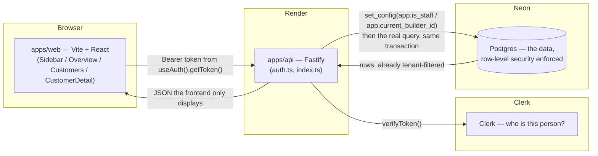
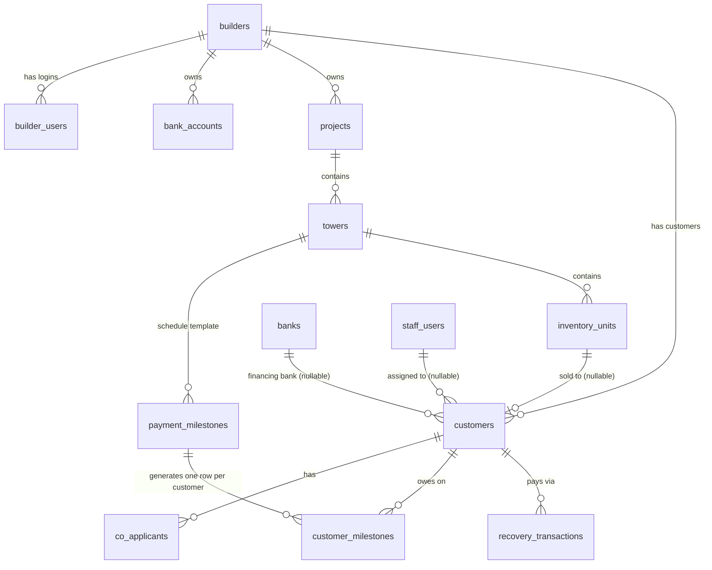
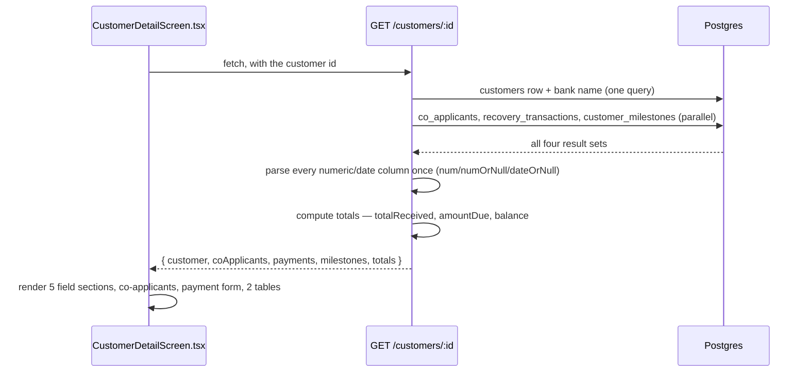
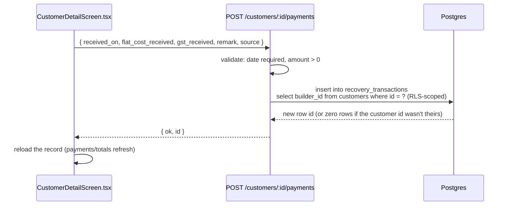

# Technical Documentation

**Audience:** whoever is fixing a bug or building the next feature — Azhar,
a future developer, or a future Claude Code session with no memory of how
this was built. `CLAUDE.md` at the repo root tells the *story* (how we got
here, what was decided and why); this file is the *reference* — schema,
data flow, and a file-by-file index so a broken thing can be found fast.

**Keep this updated.** Every commit that adds a table, a route, or a
screen should touch this file in the same commit — a new row in the
tables below, a new flow diagram if the change introduces one, one line
in the file-by-file index. A documentation update that lags the code it
describes is worse than no documentation, because it actively misleads
whoever reads it next. See `docs/FUNCTIONAL_GUIDE.md` for the same rule
applied to the user-facing/business doc.

---

## 1. Architecture at a glance



The one rule everything else follows: **the API decides, the frontend
displays.** No business number is computed in `apps/web`, and no access
decision is made there either — every route re-derives who's asking from
the verified Clerk token, never from anything the client claims. Full
reasoning and history: `CLAUDE.md`.

---

## 2. Database schema map

13 tables, `db/migrations/0001_init.sql` (`0002`/`0003` alter auth columns
and RLS — see §2.3). Every tenant-scoped table carries `builder_id`
directly, even where it could be derived through a join, so the same
row-level-security rule applies everywhere without tracing through
multiple tables.

### 2.1 Entity-relationship map



### 2.2 Table-by-table

| Table | What it holds (business terms) | RLS? |
|---|---|---|
| `banks` | The list of financing banks a customer's loan can be against. Shared across every builder. | No — shared reference data |
| `staff_users` | Perfect Solutions' own employees. See every builder's data. | No — only reached by staff-gated code paths |
| `builders` | A builder company we work with (e.g. Shilpkaar). | No — the tenant root itself |
| `builder_users` | A builder's own admin/CRM logins. Scoped to their one builder. | **No, deliberately** — see §2.3, bug 3 |
| `bank_accounts` | A builder's own bank accounts (where their collections land). | Yes |
| `projects` | A builder's real-estate project (e.g. "Aarambh"). | Yes |
| `towers` | One tower/building within a project (e.g. "E3"). | Yes |
| `payment_milestones` | The payment-schedule *template* for a tower — e.g. "Plinth, 15%, due on X". Not per-customer yet. | Yes |
| `inventory_units` | One flat/unit in a tower (3 BHK, floor, flat no., rate). | Yes |
| `customers` | The actual buyer — booking/agreement/loan/GST/stamp-duty facts. ~35 columns. See §2.4 for what's deliberately *not* here. | Yes |
| `co_applicants` | A customer's co-applicant(s) on the loan/agreement. | Yes |
| `customer_milestones` | One row per customer per milestone — generated from `payment_milestones`, tracks `amount_due` / `due_date` / `status`. | Yes |
| `recovery_transactions` | The actual payment ledger — every rupee received, one row per payment. Source of truth for "amount received." Insert-only (§4, `POST /customers/:id/payments`). | Yes |

### 2.3 Row-level security, in one paragraph

Every RLS-protected table has one policy: `is_staff OR builder_id =
current_builder_id`, and it's **forced** (`FORCE ROW LEVEL SECURITY` —
binds even to the table's owning DB role, not just other roles — see
`db/migrations/0003_force_rls.sql`'s comments for the real production bug
this fixed). The API sets `app.is_staff` / `app.current_builder_id` as
Postgres session variables, scoped to one transaction
(`apps/api/src/auth.ts`, `withTenantClient`), from the *verified* Clerk
identity — never from anything the client sends. `builder_users` has RLS
turned **off** on purpose: the very query that looks up which builder a
login belongs to has to run *before* any tenant context exists, so RLS on
that one table would make every builder login return zero rows, forever.

### 2.4 What's deliberately not in the schema

Spreadsheet formula/derived columns (Basic Value formula, Agreement Value
formula, the per-stage percentage columns) are **not** stored — they
belong in a future ported calculation engine (`packages/calc-engine`, not
built yet), computed from the raw inputs above. Storing the same fact in
two derived forms is exactly the bug class the original MIS handover
document flagged (its "defect 1") — this schema avoids it by construction.

---

## 3. How data actually flows

### 3.1 Login → identity → tenant-scoped query

```mermaid
sequenceDiagram
    participant U as User's browser
    participant C as Clerk
    participant A as API (auth.ts)
    participant D as Postgres

    U->>C: sign in
    C-->>U: session token
    U->>A: any request, Authorization: Bearer <token>
    A->>C: verifyToken()
    C-->>A: clerkUserId
    A->>D: select from staff_users / builder_users where clerk_user_id = ?
    D-->>A: identity (staff, or builder + builderId)
    A->>D: begin; set_config(app.is_staff / app.current_builder_id)
    A->>D: the actual query (same transaction)
    D-->>A: rows, already filtered by RLS
    A->>D: commit
    A-->>U: JSON
```

Where this lives: `requireAuth` (verifies the token, rejects with 401/403)
and `withTenantClient` (sets the session variables and runs the real query
in the same transaction — the `begin`/`commit` matters, see the long
comment on it) — both in `apps/api/src/auth.ts`.

### 3.2 Opening a customer's record



A missing id and an id belonging to another builder both come back as the
same 404 — telling them apart would leak whether an id exists on another
tenant's data.

### 3.3 Recording a payment



Insert-only, on purpose — Launch Guardrails' standard is that a financial
record is never edited or deleted, only reversed with a new entry (the
reversal flow itself isn't built yet — a known, deliberate gap).
`builder_id` is derived from the customer row itself, never trusted from
the client — a customer id from another builder just matches zero rows.

---

## 4. API route reference

`apps/api/src/index.ts` unless noted. "RLS" = runs inside
`withTenantClient` (tenant-scoped); "no RLS" = plain `pool.query` (shared
reference data or unauthenticated).

| Method & path | What it does | Auth | RLS |
|---|---|---|---|
| `GET /health` | Liveness check for Render. | none | — |
| `GET /db-check` | Confirms the API can reach Postgres. | none | — |
| `GET /me` | Resolves the caller's identity (staff or builder) from their Clerk token. | required | — |
| `GET /customers` | The list view's handful of columns, every customer this identity can see, capped at 1000 (stopgap, not real pagination). | required | Yes |
| `POST /customers` | Creates a customer from `NewCustomerScreen.tsx`'s form fields. Staff must pass `builder_id`; a builder identity always uses their own. | required | Yes |
| `GET /customers/:id` | The full record + co-applicants + payments + milestones + totals. See §3.2. | required | Yes |
| `PATCH /customers/:id` | Updates only fields in `EDITABLE_CUSTOMER_FIELDS` (a hardcoded allowlist — never built from the request body's own keys). | required | Yes |
| `POST /customers/:id/payments` | Records one payment. Insert-only. See §3.3. | required | Yes |
| `GET /banks` | Financing-bank dropdown options. Shared across builders. | required | No |
| `GET /builders` | Builder-picker options for staff creating a customer. **Staff only** — a builder identity gets 403 (they'd otherwise see every other builder's name). | required | No (app-level staff check instead) |
| `GET /dashboard/overview` | The six Overview KPI tiles + all 4 "Collection & loan pipeline" chart cards, computed in one SQL query. | required | Yes |
| `GET /dashboard/daily-collection?weeks=N` | The daily-collection chart's data for a given range (4/12/26/52 weeks) — separate from `/dashboard/overview` so switching the range doesn't re-run the KPI/donut/bank-bar queries. | required | Yes |

---

## 5. Frontend file-by-file index

`apps/web/src/`. "Renders" = what a user sees; "Calls" = which API routes
it talks to.

| File | Renders / does | Calls |
|---|---|---|
| `main.tsx` | Mounts the app, wraps it in `ClerkProvider` (with the brand-font `appearance` prop), imports `index.css`. | — |
| `index.css` | The one global CSS file in an otherwise fully-inline-styled app — loads IBM Plex Sans and sets it as the `body` default. | — |
| `App.tsx` | Top-level shell: signed-out vs signed-in, fetches `/me` + `/customers` + `/dashboard/overview` on load, owns `activeScreen`/`selectedCustomerId` routing state, renders `Sidebar` + the active screen. `loadCustomers()` here is reusable (called again after creating a customer). | `/me`, `/customers`, `/dashboard/overview` |
| `Sidebar.tsx` | Dark nav rail — Action Items / Dashboard (Overview, +3 disabled "soon") / Records (Customers, +2 disabled) / Settings. Brand mark + collapse toggle + Clerk's `<UserButton/>`. | — |
| `PageHeader.tsx` | Shared all-caps title + 2 disabled icon buttons (email/export — "soon"), used by every screen. | — |
| `OverviewScreen.tsx` | 6 KPI tiles + 4 chart cards (`DonutChart`, `BarChart` ×2, `LineChart`). `KpiTile` is the reusable tile; `ChartCard` (in this file) is the reusable "chart + View as table" wrapper. | `/dashboard/daily-collection` (range changes only — the rest arrives via `App.tsx`'s initial fetch) |
| `DonutChart.tsx` | The disbursement-split donut — hover-explode + anchored tooltip, 4 categories (violet as the accessibility-passing 4th color, not the docs-default yellow — see the file's own comment). | — |
| `BarChart.tsx` | Reused for both "loan by bank" and "outstanding by customer" — a ranked single-hue bar chart is the same shape either way. | — |
| `LineChart.tsx` | Daily collection, with a hover crosshair (too many points to direct-label each one). | — |
| `CustomersScreen.tsx` | Purely a list view now — supplies `CUSTOMER_COLUMNS` (name/phone/email/stage, with the stage-badge renderer) to `DataTable`; "New" is handed straight through to `App.tsx`, which owns which screen is showing (list, a record, or the new-customer screen). | — (all fetching happens in `App.tsx`) |
| `DataTable.tsx` | **The generic list engine.** Sortable columns (in `visibleKeys`' own order — the slushbucket's ↑/↓ reordering changes this, not just visibility), per-column Contains/Starts-with filter (portaled to `document.body`, viewport-edge-aware — see the file's own comments on both bugs that made that necessary), gear-icon column-visibility slushbucket (saved to `localStorage`), optional "New" button. Every future table screen should plug into this rather than building its own table. | — |
| `CustomerDetailScreen.tsx` | The full customer record, in 3 tabs (`TabBar`, local to this file): **Overview** (summary tiles, `MilestoneProgress` stacked-bar, `RecentPayments` — last 3), **Details** (5 field sections, each togglable edit↔view), **Related records** (co-applicants read-only, record-a-payment form, payment history table, milestone table). Name/stage header and Edit/Save/Cancel are global to the record, not per-tab — clicking Edit always jumps to Details. Also exports `STAGE_OPTIONS`, `Section`, `backLinkStyle` (shared with `NewCustomerScreen.tsx`). | `GET /customers/:id`, `GET /banks`, `PATCH /customers/:id`, `POST /customers/:id/payments` |
| `NewCustomerScreen.tsx` | The "New" button's form — a full page (`← Back` link, `Section` cards), not a modal. Name/agreement no./phone/email/stage, plus a builder picker shown only to staff. | `GET /builders` (staff only), `POST /customers` |
| `types.ts` | Every shared TypeScript type, matching the API's response shapes exactly — the frontend's single source of truth for "what does the API send back." | — |
| `format.ts` | Presentational-only number/date formatting (`formatCompactInr`'s Cr/L/K form, `formatPct`, `formatShortDate`'s UTC-safe parsing). Never derives a figure. | — |

---

## 6. "Something broke — where do I look?"

| Symptom | Likely file(s) |
|---|---|
| A builder can see another builder's data | `db/migrations/0003_force_rls.sql`'s policy, or a new table that forgot `FORCE ROW LEVEL SECURITY` — check §2.3 |
| A builder login gets "0 customers" but staff sees data fine | `withTenantClient` in `apps/api/src/auth.ts` — the `begin`/`commit` wrapping (see its comment — this exact bug happened once) |
| A number on Overview looks wrong | `GET /dashboard/overview` in `apps/api/src/index.ts` — every KPI is computed in one SQL query there, nothing is computed client-side |
| A field won't save on the customer detail page | `EDITABLE_CUSTOMER_FIELDS` in `apps/api/src/index.ts` — the field has to be on this allowlist, and its `dbKey` has to match in `CustomerDetailScreen.tsx`'s field-def arrays |
| A new column/table's data isn't showing up anywhere | Check RLS is enabled+forced on it (§2.3), and that a frontend type/column was actually added — the API never invents a field the frontend doesn't ask for |
| Frontend changes aren't showing up after a push | Render's static site build can take several minutes, and Cloudflare's edge cache (`s-maxage=300`) can serve a stale HTML shell for up to 5 minutes after that — cache-bust with a `?cb=` query param before concluding a deploy is stuck |
| A `VITE_`-prefixed env var change isn't taking effect | It's baked in at build time, not read at runtime — trigger a manual redeploy of `perfect4developers-app`, and verify by the bundle's actual content, not just its filename hash |

---

## 7. Keeping this file honest

Every migration, every new route, every new screen: update the relevant
table/diagram above **in the same commit**. If a change is small enough
that updating this feels like overkill, it almost never is — a missing
row here is exactly the gap that costs someone an hour of `grep`ing later.
